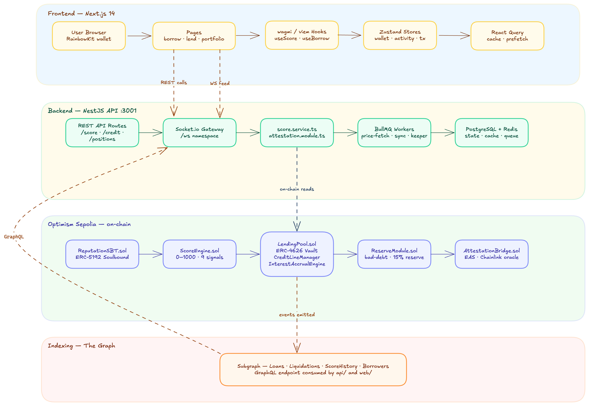

# TraceCredit — Reputation-Based Undercollateralized Lending Protocol

A full-stack DeFi lending protocol on **Optimism Sepolia** where borrowers access undercollateralized USDC loans based on on-chain reputation scores stored in **ERC-5192 Soulbound Tokens**. Lenders deposit into an **ERC-4626 vault** and earn yield from borrower interest.

---

## Architecture Overview



---

## Repository Structure

```
tracecredit/
├── contracts/          Smart contracts (Solidity · Foundry)
├── api/                Backend API (NestJS · TypeScript)
├── web/                Frontend (Next.js 14 · wagmi · viem)
├── package.json        Monorepo root (yarn workspaces)
└── README.md
```

---

## Smart Contracts

**Network:** Optimism Sepolia (Chain ID: 11155420)
**Toolchain:** Foundry · OpenZeppelin Upgradeable · Solidity 0.8.24

### Contract Architecture

```
contracts/src/
├── core/
│   ├── LendingPool.sol          ERC-4626 vault · 5-state loan FSM · 15% reserve factor
│   ├── ScoreEngine.sol          0-1000 score · 9+ signals · log gain curve · decay
│   └── ReputationSBT.sol        ERC-5192 soulbound token · 50 USDC stake · blacklist
├── modules/
│   ├── CreditLineManager.sol    Per-wallet limits · tier lockups (14–90 days)
│   ├── InterestAccrualEngine.sol  Stateless kink-model interest math (pure/view)
│   ├── LiquidationManager.sol   Keeper flow · score penalty · credit freeze · write-off
│   ├── SBTStakeVault.sol        USDC stake custody · 30-day unlock delay
│   ├── RateLimiter.sol          24-hour rolling borrow limits per tier
│   ├── FeeCollector.sol         Protocol fee routing
│   └── EmergencyPause.sol       Circuit breaker
├── oracle/
│   └── AttestationBridge.sol    M-of-N quorum · 1-hour window · Gitcoin/Aave/Chainlink
└── base/
    ├── ProtocolBase.sol          GOVERNOR_ROLE · GUARDIAN_ROLE · AccessControl
    └── VaultBase.sol             ERC-4626 base (tcUSDC shares)
```

### Tier System

| Tier     | Credit Limit | Interest APY | Lockup  |
| -------- | ------------ | ------------ | ------- |
| Bronze   | $0           | 18%          | 90 days |
| Silver   | $500         | 18%          | 90 days |
| Gold     | $5,000       | 14%          | 60 days |
| Platinum | $25,000      | 10%          | 30 days |
| Diamond  | $100,000     | 7%           | 14 days |

### Score Signals

| Signal                | Delta                                |
| --------------------- | ------------------------------------ |
| On-time repayment     | +40 pts                              |
| Cross-protocol signal | +30 pts                              |
| Wallet age            | +20 pts                              |
| SBT staking           | +15 pts                              |
| DAO governance vote   | +10 pts                              |
| Late repayment        | -50 pts                              |
| Default / liquidation | -200 pts                             |
| Inactivity decay      | -1 pt / 30 days (after 90-day grace) |

### Running Tests

```bash
cd contracts
forge test                    # all tests
forge test --match-contract ScoreEngine  # specific contract
forge coverage                # coverage report
```

---

## Backend API

**Stack:** NestJS v10 · TypeScript · PostgreSQL · Redis · BullMQ · Socket.io
**Port:** 3001
**Swagger:** `http://localhost:3001/docs`

### Module Structure

```
api/src/
├── score/          GET /:wallet/profile · /events · /db-history
├── credit/         GET /:wallet/line · /rate-limit
├── positions/      GET /:wallet · /loan/:id · /snapshots/:wallet
├── vault/          GET /stats · /shares/:wallet
├── yield/          GET /apy · /pending/:wallet
├── pool/           GET /overview · /borrows · /liquidations
├── price/          GET /usdc · /usdc/history
├── attestation/    GET /config · /:wallet/history
├── liquidation/    GET / · /stats · /:wallet
├── analytics/      GET /protocol · /volume
├── anchor/         GET /:wallet/compliance
├── portfolio/      GET /:wallet  (aggregated snapshot)
├── gateway/        WebSocket — Socket.io namespace /ws
├── database/       TypeORM · 8 entities · migrations
├── queue/          BullMQ — liquidation · score-sync · price-fetch
└── cache/          Redis cache-manager (60s TTL)
```

### Database Entities

| Entity            | Purpose                                        |
| ----------------- | ---------------------------------------------- |
| BorrowerProfile   | Wallet score, tier, credit limits, SBT state   |
| LoanSnapshot      | Loan state snapshots (active/repaid/defaulted) |
| ScoreEvent        | Per-signal event log with attestation payload  |
| ScoreHistory      | Score change history with source tracking      |
| LpPosition        | LP shares, deposited value, yield earned       |
| LiquidationRecord | Recovery amounts, write-off, tx hash           |
| PoolStat          | Utilisation, APY, TVL snapshots                |
| PriceSnapshot     | Chainlink USDC/USD feed history                |

### WebSocket Events

```
Namespace: /ws

Emits:
  loan:created       → new borrow event
  loan:repaid        → repayment confirmed
  loan:liquidated    → liquidation executed
  score:updated      → score change (any signal)
  circuit:breaker    → protocol pause triggered

Subscribe per wallet:
  subscribe:wallet   { wallet: '0x...' }
  unsubscribe:wallet { wallet: '0x...' }
```

### Liquidation Keeper Bot

Runs every **60 seconds** via BullMQ repeatable job:

```
Scan defaulted loans (grace period expired)
        ↓
Score penalty      (-200 pts via ScoreEngine)
        ↓
Credit freeze      (12-month via CreditLineManager)
        ↓
Reserve absorption (via FeeCollector)
        ↓
Loan marked        WrittenOff
```

### Setup

```bash
# Prerequisites: PostgreSQL · Redis

cd api
cp .env.example .env.development    # fill in DB, Redis, RPC, contract addresses
npm install
npm run start:dev                   # starts on port 3001, auto-creates tables
npm run seed:dev                    # seed mock data for development
```

---

## Blockchain Indexing (The Graph)

Subgraph deployed on The Graph Protocol indexing events from LendingPool and ScoreEngine.

### Indexed Entities

```
Loans           → created, repaid, defaulted, liquidated
ScoreUpdates    → signal type, delta, score after
Liquidations    → recovered amount, written-off, keeper tx
Borrowers       → cumulative borrow/repay totals
```

### Queried From

- **Backend** — GraphQL queries for loan history, liquidation records, score changes
- **Frontend** — React Query hooks via backend proxy endpoints

---

## Frontend

**Stack:** Next.js 14 (App Router) · wagmi v2 · viem v2 · TanStack React Query v5
**Port:** 3000

### Pages

```
web/app/
├── (main)/
│   ├── page.tsx              Dashboard — TVL, utilisation, live activity feed
│   ├── borrow/               Score panel, credit bar, borrow form, active loans
│   ├── lend/                 LP position, deposit/withdraw, APY breakdown
│   ├── portfolio/            Net worth, health cards, borrow + LP positions
│   ├── reputation/           SBT card, score arc, signals, attestations, decay
│   ├── markets/              Volume chart, borrows table, score distribution
│   ├── liquidations/         Liquidation table, recovery panel, keeper status
│   ├── history/              Loan history table + individual loan detail
│   └── score-history/        Score trend chart, signal breakdown, event table
└── onboarding/               Multi-step — connect wallet → mint SBT → stake USDC
```

### Data Flow

```
Component
    ↓  calls
Hook (hooks/use-*.ts)
    ↓  React Query useQuery
Data Layer (lib/data/*.ts)
    ↓  try API call
apiClient (lib/api/*.ts)           → NestJS API (port 3001)
    ↓  catch (API down)
Mock fallback (lib/mock/*.json)    → local JSON (always works)
```

### State Management

| Store          | Holds                                    |
| -------------- | ---------------------------------------- |
| wallet-store   | Connected wallet address and chain ID    |
| activity-store | Live feed items (max 50) from WebSocket  |
| tx-modal-store | Active transaction modal and its payload |

### Environment Variables

```bash
NEXT_PUBLIC_API_URL=http://localhost:3001
NEXT_PUBLIC_WS_URL=http://localhost:3001
NEXT_PUBLIC_WALLETCONNECT_PROJECT_ID=
NEXT_PUBLIC_LENDING_POOL_ADDRESS=
NEXT_PUBLIC_REPUTATION_SBT_ADDRESS=
NEXT_PUBLIC_SCORE_ENGINE_ADDRESS=
NEXT_PUBLIC_USDC_ADDRESS=0x5fd84259d66Cd46123540766Be93DFE6D43130D7
```

### Setup

```bash
cd web
cp .env.local.example .env.local    # fill in API URL and contract addresses
npm install
npm run dev                          # starts on port 3000
```

---

## Full Stack Setup

### Prerequisites

```
Node.js 18+
PostgreSQL 14+
Redis 7+
Foundry (for contracts)
```

### Start Order

```bash
# 1. Start PostgreSQL and Redis

# 2. Start API (creates tables on first run)
cd api && npm run start:dev

# 3. Seed development data
npm run seed:dev

# 4. Start frontend
cd web && npm run dev

# 5. Open browser
http://localhost:3000        # Frontend
http://localhost:3001/docs   # Swagger API docs
```

### Monorepo Scripts (from root)

```bash
yarn dev:api        # start NestJS API
yarn dev:web        # start Next.js frontend
yarn build          # build all workspaces
yarn test:contracts # run Foundry tests
yarn test:api       # run NestJS tests
yarn lint           # lint all workspaces
```

---

## Tech Stack

| Layer      | Technology                                                     |
| ---------- | -------------------------------------------------------------- |
| Contracts  | Solidity 0.8.24 · Foundry · OpenZeppelin · ERC-4626 · ERC-5192 |
| Network    | Optimism Sepolia (Chain ID: 11155420)                          |
| Indexing   | The Graph Protocol · GraphQL                                   |
| Backend    | NestJS · TypeScript · TypeORM · PostgreSQL                     |
| Queues     | BullMQ · Redis                                                 |
| Real-time  | Socket.io WebSocket gateway                                    |
| Frontend   | Next.js 14 · React 18 · TypeScript · Tailwind CSS              |
| Blockchain | wagmi v2 · viem v2                                             |
| State      | TanStack React Query v5 · Zustand                              |
| UI         | shadcn/ui · Radix UI · Recharts · Lucide                       |
| Wallets    | MetaMask · WalletConnect · Coinbase Wallet                     |

---

## License

MIT
